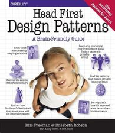

# Design Patterns Head First
I am reading this book to learn popular design patterns like Singleton, Multiton, MVC, template, Strategy and others.

### Motivations
- OOP software design is everywhere and learning about it could be useful in writing/using existing or new frameworks.
- Experience-learning can be useful when It comming to design your own software.
- One can reinvent the wheel to learn how things work but it is also great to learn from previous experiences when it comes to design phase.
- Design patterns like singleton, multiton, strategy, pimpl, template, MVC, ... ,etc are popular.
- At the end of the day they are just tools and they could be helpful some day.

### Languages
- **Java**

### Chapters
#### 1. Introduction [Strategy Pattern]
- Taking about the composition vs inheritance and how sometimes composition could be more practical than inheritance when it comes to maintenance and change.
- RTTI, polymorphism, dynamic typing, encapsulation.
- Separating code that changes from that doesn't.
- How learning dp could be useful.
- basic problems, mainly array-based problems.
- How to represent a pool of resources/behaviors/algorithms and dynamically pick from it.
- [Code](./introduction/)
