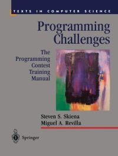

# BOOKS
This is a list of books I read and am reading. It could include books in programming languages,
machine learning, algorithms and data structures, web development, security, ..... etc.

`for me, learning by reading and applying what I read is a good way to get better on the topic I am intersted in.`

I just publish them on github to share my notes and solutions with people who may find it useful.

## Books
### Algorithms and data structures
* [Programming challenges](https://www.amazon.com/Programming-Challenges-Contest-Training-Computer/dp/0387001638)

### C++ lang
* [Effective modern c++](https://www.amazon.com/Effective-Modern-Specific-Ways-Improve/dp/1491903996)

### Design patterns
* 

### System design

### Machine Learning

### Deep learning

### Artificial intelligence

### Python lang

### Go lang

### Web front end

### Web back end

### Security

### Networking

### Linux

### Operating systems

### Database

### Blockchain

### CI/CD

### Cloud Computing

### Microservices

### Mobile Development

### Compiler

### language design

### Misc
